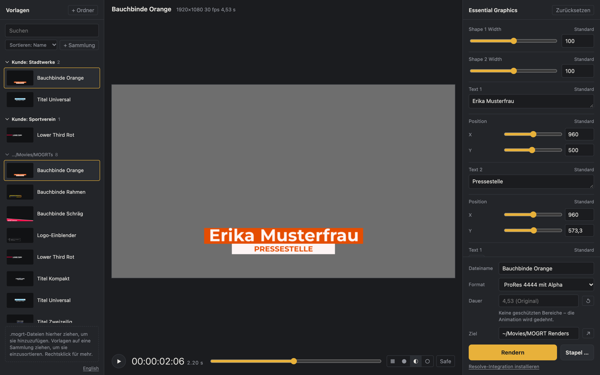

<p align="center">
  
</p>

<h1 align="center">MOGRT Converter</h1>

<p align="center"><a href="README.md">English</a> · <b>Deutsch</b> · <a href="README.zh.md">简体中文</a></p>

<p align="center">
  After-Effects-Vorlagen (<code>.mogrt</code>) ohne Adobe ausfüllen und rendern – als ProRes 4444 mit Alpha für DaVinci Resolve.
</p>

<p align="center">
  <a href="https://github.com/nielsfranke/MOGRT-Converter/releases/latest"><b>Download für macOS</b></a> ·
  <a href="#installation">Installation</a> ·
  <a href="#benutzung">Benutzung</a> ·
  <a href="#was-unterstützt-wird">Was unterstützt wird</a>
</p>

<p align="center">
  
</p>

## Worum es geht

Bauchbinden, Einblender und Outros liegen oft als Motion Graphics Templates aus After Effects vor. In Premiere füllt man sie über *Essential Graphics* aus. Wer zu DaVinci Resolve wechselt, kann sie nicht mehr öffnen.

Der MOGRT Converter liest die Vorlage direkt und rendert sie mit einem eigenen Renderer, der das Verhalten von After Effects nachbildet. Weder After Effects noch Premiere werden gebraucht. Du füllst die Regler aus wie in Premiere, siehst sofort eine Vorschau und renderst einen Clip mit transparentem Hintergrund, der in Resolve direkt auf die Timeline kann.

- **Live-Vorschau** mit Abspielen, Scrubben, Transparenz-Schachbrett und Title-Safe-Rahmen. Beim Abspielen rendert die App auf allen Prozessorkernen voraus, ab dem zweiten Durchlauf läuft auch eine aufwendige Vorlage flüssig
- **Bibliothek ordnen:** Sammlungen anlegen (z. B. eine pro Kunde), Vorlagen umbenennen, sortieren und aus der Liste entfernen
- **Alle Regler der Vorlage**: Texte, Slider, Checkboxen, Farben, Positionen, Skalierung
- **Dauer ändern** wie in Premiere: Ein- und Ausblendung (geschützte Bereiche) bleiben erhalten, nur der Mittelteil wird angepasst
- **Bewegung** wie in Premiere: Position, Skalierung, Drehung und Deckkraft, auch per Maus direkt in der Vorschau verschieben
- **Stapel-Rendering**: viele Varianten auf einmal, als Tabelle in der App oder per CSV aus Excel/Numbers
- **ProRes 4444 mit Alpha** (auch 4444 XQ, PNG-MOV oder H.264), Ton aus der Vorlage inklusive
- **Resolve-Integration**: Clips per Script in einen Bin „MOGRTs“ im Media Pool holen
- **Kommandozeile** für Stapelverarbeitung
- **Deutsch, Englisch und Chinesisch**: die Oberfläche folgt der Systemsprache, umschaltbar unten links

## Installation

### macOS

1. [`MOGRT-Converter-0.6.1-macOS-arm64.dmg`](https://github.com/nielsfranke/MOGRT-Converter/releases/latest) herunterladen (Apple Silicon).
2. DMG öffnen und **MOGRT Converter** in den Ordner *Programme* ziehen.
3. Beim ersten Start: Rechtsklick auf die App → **Öffnen**. Die App ist nicht bei Apple notarisiert.

ffmpeg und Ghostscript (für EPS-Logos in Vorlagen) sind in der App enthalten, es muss nichts zusätzlich installiert werden.

### Windows und Linux

Download im [neuesten Release](https://github.com/nielsfranke/MOGRT-Converter/releases/latest) (x64, gebaut von GitHub Actions, weniger getestet als die Mac-Version):

- **Windows:** `…-Setup.exe` (Installer) oder `…-Windows-x64.zip` (ohne Installation). Braucht die WebView2-Runtime, die bei Windows 10/11 meist vorinstalliert ist.
- **Linux:** `…-Linux-x64.tar.gz` entpacken, `./install.sh` ausführen. Für das native Fenster `sudo apt install gir1.2-webkit2-4.1`, ohne öffnet sich die Oberfläche im Browser.

## Benutzung

1. **Vorlagen hinzufügen:** über *+ Ordner* oder *+ Datei*, per Drag-and-Drop ins Fenster, oder per Doppelklick auf eine `.mogrt`.
   **Ordnen:** *+ Sammlung* legt eine Sammlung an, etwa für einen Kunden, dessen Vorlagen du immer wieder brauchst. Vorlagen per Maus auf die Sammlung ziehen oder über Rechtsklick (bzw. *⋯*) hinzufügen. Dort kannst du Vorlagen auch umbenennen oder *aus der Liste entfernen* (die Datei bleibt auf der Festplatte). Ordner entfernst du über Rechtsklick auf die Ordnerzeile. Sortieren nach Name, zuletzt geöffnet oder neuesten Dateien.
2. **Ausfüllen:** Rechts erscheinen die Regler der Vorlage. Die Vorschau aktualisiert sich beim Tippen. Leertaste spielt ab, die Pfeiltasten springen frameweise.
   Unter *Bewegung* lässt sich die ganze Grafik verschieben, skalieren, drehen und ausblenden – wie die Bewegungs-Eigenschaften eines Clips in Premiere. Am schnellsten: die Grafik in der Vorschau mit der Maus ziehen (mit Umschalttaste nur senkrecht), etwa um eine Bauchbinde für Social Media höher zu setzen.
3. **Rendern:** Format, Zielordner und bei Bedarf eine neue *Dauer* wählen (`8`, `8,5`, `00:00:08:12` oder `200f`), dann *Rendern* klicken. Standardziel ist `~/Movies/MOGRT Renders`.
4. **Stapel:** *Stapel …* öffnet eine Tabelle: eine Zeile pro Datei, mit allen Reglern, Dateiname und Dauer. Zeilen lassen sich in der Vorschau ansehen, duplizieren oder per *CSV importieren* aus Excel übernehmen. *CSV-Vorlage speichern* liefert eine passende Tabelle mit allen Spalten.
5. **In Resolve:** einmal *Resolve-Integration installieren* klicken. Danach findest du in Resolve unter *Workspace → Scripts*:
   - **MOGRT Renders importieren** holt neue Clips in den Bin „MOGRTs“.
   - **MOGRT Converter starten** öffnet die App.

**Fehlende Schriften:** Nutzt eine Vorlage eine Schrift, die nicht installiert ist, zeigt die App einen Hinweis und rendert mit einer Ersatzschrift. Freie Schriften lädt *Von Google Fonts laden* automatisch (auch einzelne Schnitte variabler Fonts). Kommerzielle Schriften legst du über *Font-Ordner öffnen* ab und öffnest die Vorlage erneut. Montserrat und Source Sans Pro sind bereits enthalten.

### Kommandozeile

```bash
mogrt info vorlage.mogrt                                  # Regler und Schriften anzeigen
mogrt fonts vorlage.mogrt --download                      # fehlende freie Schriften von Google Fonts laden
mogrt still vorlage.mogrt -t 2.5 -o vorschau.png          # Einzelbild
mogrt render vorlage.mogrt --set "Titel=Erika Musterfrau" --set "Untertitel=Leitung Kommunikation" -o bauchbinde
mogrt render vorlage.mogrt -d 8 -o bauchbinde_8s                    # neue Dauer (Ein-/Ausblendung bleiben)
mogrt render vorlage.mogrt --offset 0,-300 -o bauchbinde_hoch       # 300 px höher (auch --position, --motion-scale, --rotation, --opacity)
mogrt batch vorlage.mogrt --template namen.csv                       # CSV-Vorlage mit allen Spalten
mogrt batch vorlage.mogrt namen.csv -o renders/                       # eine Datei pro Zeile
```

**CSV-Format:** Spaltenüberschriften sind die Reglernamen der Vorlage (siehe `mogrt info`), dazu optional `Dateiname` und `Dauer`. Trennzeichen Semikolon, Komma oder Tab, UTF-8 oder Windows-Kodierung. Leere Zellen nutzen den Standardwert. Farben als `#RRGGBB`, Positionen als `960 540`, Checkboxen als `ja`/`nein`. Mehrzeiliger Text wie in Excel (Alt+Enter) oder mit `\n`.

In der Mac-App heißt der Befehl `"/Applications/MOGRT Converter.app/Contents/MacOS/MOGRT Converter"`, unter Windows `mogrt.exe` im App-Ordner.
Formate (`-f`): `prores4444` (Standard), `prores4444xq`, `png-mov`, `h264`.

## Was unterstützt wird

<details>
<summary>Ebenen, Effekte, Expressions</summary>

- **Shape-Ebenen:** Pfade, Rechteck, Ellipse, Stern, Fill/Stroke, Verläufe, Trim Paths, Round Corners, Merge Paths, Offset, Dashes
- **Text:** Punkt- und Absatztext, Animatoren mit Bereichsauswahl (Deckkraft, Position, Skalierung, Drehung, Farbe, Laufweite)
- **Komposition:** Precomps, Parenting, Time-Remap, Track Mattes (Alpha/Luma), Blend Modes inklusive Stencil/Silhouette, 2,5D-Ebenen mit Kamera, Masken, Einstellungsebenen
- **Effekte:** Schlagschatten, Verlauf, Gaußscher Weichzeichner, Kamera-Linsenunschärfe, Lineare Blende, Füllen, Färben
- **Ebenenstile:** Farbüberlagerung, Verlaufsüberlagerung, Kontur, Schlagschatten, Schein nach außen
- **Footage:** Farbflächen, Bilder, Illustrator/PDF, EPS (mit Ghostscript), Audio
- **Expressions** über eine eingebettete JavaScript-Engine: `sourceRectAtTime`, `wiggle`, `effect()`, `content()`, `thisComp.layer()`, `loopOut`, `linear`/`ease`, Vektor-Arithmetik

</details>

**Grenzen:**
- Nur in After Effects erstellte MOGRTs. In Premiere erstellte Vorlagen werden noch nicht unterstützt.
- Drittanbieter-Plugins (Trapcode, Element 3D …) und echtes 3D werden nicht nachgebildet.
- Unbekannte Effekte oder Expressions werden übersprungen. Die App warnt dann in der Konsole.

## Wie es funktioniert

Eine `.mogrt` ist ein ZIP-Archiv mit dem After-Effects-Projekt und einer Beschreibung der Regler. Der Converter liest das Projekt mit [py-aep](https://github.com/forticheprod/py-aep), setzt die Reglerwerte ein und rendert jeden Frame mit [Skia](https://skia.org). Text wird mit HarfBuzz gesetzt, Expressions laufen in QuickJS. ffmpeg schreibt das Video.

## Entwicklung

```bash
uv venv -p 3.12 .venv && uv pip install -p .venv -e ".[build,dev]"
.venv/bin/mogrt app                    # Oberfläche im Browser (Entwicklungsmodus)
.venv/bin/mogrt-converter              # Oberfläche im nativen Fenster
.venv/bin/python -m pytest tests       # Unit-Tests; rendert zusätzlich alle .mogrt in samples/
.venv/bin/mogrt inspect vorlage.mogrt  # Ebenen, Keyframes und Expressions ausgeben
```

### Testbestand

`samples/` und `testdata/` sind nicht im Repo, weil Vorlagen eigene Lizenzen haben. Leg eigene `.mogrt`-Dateien nach `samples/`, dann rendert `tests/test_samples.py` jede davon.

Für breitere Tests lassen sich beliebig viele MOGRTs in `testdata/` ablegen. `tools/corpus.py` rendert alle, sammelt nicht unterstützte Effekte, fehlschlagende Expressions und fehlende Schriften und vergleicht mit mitgelieferten Vorschauvideos:

```bash
MOGRT_DATA_DIR=testdata/appdata .venv/bin/python tools/corpus.py testdata -o out/corpus   # Bericht: out/corpus/report.md
MOGRT_CORPUS=1 .venv/bin/python -m pytest tests/test_corpus.py
```

Kostenlose Vorlagen ohne Anmeldung gibt es z. B. bei [Mixkit](https://mixkit.co/free-premiere-pro-templates/mogrt/) (Lizenz beachten: nutzen ja, weiterverteilen nein). Auch der Screenshot oben zeigt Mixkit-Vorlagen.

### Selbst bauen

```bash
.venv/bin/python packaging/build.py    # baut für das aktuelle System (macOS: .app + .dmg)
docker run --rm -v "$PWD":/src -w /src python:3.12-bookworm sh packaging/linux/build-in-docker.sh
```

Der Build kompiliert dabei ein schlankes Ghostscript aus den offiziellen Quellen (`packaging/ghostscript/build_gs.sh`, unter Windows wird ein installiertes offizielles Ghostscript übernommen). Mitgelieferte Fremdsoftware und Lizenzen: [THIRD-PARTY-NOTICES.md](THIRD-PARTY-NOTICES.md).

PyInstaller baut nur für das System, auf dem es läuft. Der Workflow `.github/workflows/build.yml` baut alle drei Plattformen auf GitHub Actions. Manuell gestartet (*Actions → build → Run workflow*) landen die Pakete als Workflow-Artefakte.

### Release veröffentlichen

1. Version in `pyproject.toml`, `mogrt_converter/__init__.py` und den Download-Dateinamen in beiden READMEs anheben, committen.
2. Tag pushen: `git tag -a v0.7.0 -m "MOGRT Converter 0.7.0" && git push origin v0.7.0`
3. Der Build-Workflow baut macOS, Windows und Linux und hängt die Dateien an das GitHub-Release zu diesem Tag. Gibt es noch kein Release, legt er eines mit automatisch erzeugten Notizen an. Die Notizen kannst du vorher oder hinterher schreiben; gleichnamige Dateien werden ersetzt.

## Lizenz

MOGRT Converter ist freie Software unter der [GNU Affero General Public License v3.0](LICENSE) (oder einer späteren Version). Du darfst das Programm nutzen, verändern und weitergeben. Wer es verändert weitergibt oder als Netzwerkdienst anbietet, muss den Quellcode unter derselben Lizenz zugänglich machen.

Mitgelieferte Fremdsoftware (Ghostscript, FFmpeg, Schriften, Bibliotheken) und deren Lizenzen: [THIRD-PARTY-NOTICES.md](THIRD-PARTY-NOTICES.md).

After Effects, Premiere Pro und Motion Graphics Templates sind Marken bzw. Formate von Adobe. Dieses Projekt steht in keiner Verbindung zu Adobe.
