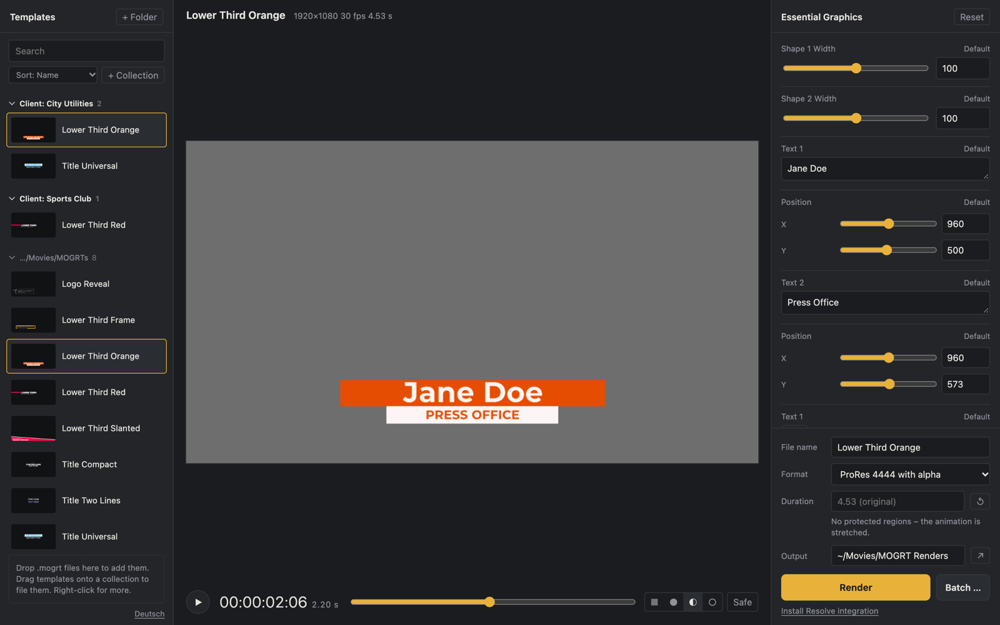

<p align="center">
  
</p>

<h1 align="center">MOGRT Converter</h1>

<p align="center"><b>English</b> · <a href="README.de.md">Deutsch</a> · <a href="README.zh.md">简体中文</a></p>

<p align="center">
  Fill in and render After Effects templates (<code>.mogrt</code>) without Adobe software – as ProRes 4444 with alpha for DaVinci Resolve.
</p>

<p align="center">
  <a href="https://github.com/nielsfranke/MOGRT-Converter/releases/latest"><b>Download for macOS</b></a> ·
  <a href="#installation">Installation</a> ·
  <a href="#usage">Usage</a> ·
  <a href="#what-is-supported">What is supported</a>
</p>

<p align="center">
  
</p>

## What it does

Lower thirds, title cards and outros often come as Motion Graphics Templates made in After Effects. In Premiere Pro you fill them in through *Essential Graphics*. Move to DaVinci Resolve and you can no longer open them.

MOGRT Converter reads the template directly and renders it with its own renderer that recreates After Effects' behaviour. Neither After Effects nor Premiere is needed. You fill in the controls like in Premiere, see a live preview and render a clip with a transparent background that goes straight onto the Resolve timeline.

- **Live preview** with playback, scrubbing, transparency checkerboard and title-safe guides. During playback the app renders ahead on all CPU cores, so even heavy templates play smoothly from the second loop on
- **All template controls**: texts, sliders, checkboxes, colours, positions, scale
- **Change the duration** like in Premiere: intro and outro (protected regions) stay intact, only the middle part is adjusted
- **Motion** like in Premiere: position, scale, rotation and opacity, also by dragging the graphic in the preview
- **Organise your library**: collections (e.g. one per client), rename, sort and remove templates from the list
- **Batch rendering**: many variants at once, as a table in the app or from a CSV exported from Excel/Numbers
- **ProRes 4444 with alpha** (also 4444 XQ, PNG-in-MOV or H.264), including the template's audio
- **Resolve integration**: a script pulls new clips into a "MOGRTs" bin in the Media Pool
- **Command line** for automation
- **English, German and Chinese**: the interface follows the system language and can be switched at the bottom left

## Installation

### macOS

1. Download [`MOGRT-Converter-0.6.1-macOS-arm64.dmg`](https://github.com/nielsfranke/MOGRT-Converter/releases/latest) (Apple Silicon).
2. Open the DMG and drag **MOGRT Converter** into *Applications*.
3. On first launch: right-click the app → **Open**. The app is not notarised by Apple.

ffmpeg and Ghostscript (for EPS logos in templates) are bundled, nothing else needs to be installed.

### Windows and Linux

Download from the [latest release](https://github.com/nielsfranke/MOGRT-Converter/releases/latest) (x64, built by GitHub Actions, less tested than the Mac version):

- **Windows:** `…-Setup.exe` (installer) or `…-Windows-x64.zip` (portable). Needs the WebView2 runtime, which is usually preinstalled on Windows 10/11.
- **Linux:** unpack the `…-Linux-x64.tar.gz` and run `./install.sh`. For the native window install `sudo apt install gir1.2-webkit2-4.1`; without it the interface opens in the browser.

## Usage

1. **Add templates:** with *+ Folder* or *+ File*, by dragging them into the window, or by double-clicking a `.mogrt`.
   **Organise:** *+ Collection* creates a collection, for example for a client whose templates you need again and again. Drag templates onto the collection or add them via right-click (or *⋯*). The same menu renames a template or *removes it from the list* (the file stays on disk). Remove a folder by right-clicking its row. Sort by name, recently opened or newest files.
2. **Fill in:** the template's controls appear on the right. The preview updates as you type. Space plays, the arrow keys step frame by frame.
   *Motion* moves, scales, rotates and fades the whole graphic – like the motion properties of a clip in Premiere. Quickest way: drag the graphic in the preview with the mouse (hold Shift for vertical only), e.g. to move a lower third up for social media.
3. **Render:** choose format, output folder and optionally a new *Duration* (`8`, `8.5`, `00:00:08:12` or `200f`), then click *Render*. The default output is `~/Movies/MOGRT Renders`.
4. **Batch:** *Batch …* opens a table: one row per file, with all controls, file name and duration. Rows can be previewed, duplicated or imported from Excel via *Import CSV*. *Save CSV template* writes a matching table with all columns.
5. **In Resolve:** click *Install Resolve integration* once. Afterwards Resolve has two entries under *Workspace → Scripts*:
   - **MOGRT Renders importieren** pulls new clips into the "MOGRTs" bin.
   - **MOGRT Converter starten** opens the app.

**Missing fonts:** if a template uses a font that is not installed, the app shows a notice and renders with a substitute. *Download from Google Fonts* fetches free fonts automatically (including single styles of variable fonts). Put commercial fonts into the folder opened by *Open font folder* and reopen the template. Montserrat and Source Sans Pro are bundled.

### Command line

The command line output is in German.

```bash
mogrt info template.mogrt                                  # list controls and fonts
mogrt fonts template.mogrt --download                      # download missing free fonts from Google Fonts
mogrt still template.mogrt -t 2.5 -o preview.png           # single frame
mogrt render template.mogrt --set "Title=Jane Doe" --set "Subtitle=Head of Communications" -o lower_third
mogrt render template.mogrt -d 8 -o lower_third_8s                   # new duration (intro/outro kept)
mogrt render template.mogrt --offset 0,-300 -o lower_third_up        # 300 px higher (also --position, --motion-scale, --rotation, --opacity)
mogrt batch template.mogrt --template names.csv                       # CSV template with all columns
mogrt batch template.mogrt names.csv -o renders/                      # one file per row
```

**CSV format:** column headers are the template's control names (see `mogrt info`), plus optional `filename` and `duration`. Separator semicolon, comma or tab, UTF-8 or Windows encoding. Empty cells use the default. Colours as `#RRGGBB`, positions as `960 540`, checkboxes as `yes`/`no`. Multi-line text as in Excel (Alt+Enter) or with `\n`.

In the Mac app the command is `"/Applications/MOGRT Converter.app/Contents/MacOS/MOGRT Converter"`, on Windows `mogrt.exe` in the app folder.
Formats (`-f`): `prores4444` (default), `prores4444xq`, `png-mov`, `h264`.

## What is supported

<details>
<summary>Layers, effects, expressions</summary>

- **Shape layers:** paths, rectangle, ellipse, star, fill/stroke, gradients, trim paths, round corners, merge paths, offset, dashes
- **Text:** point and paragraph text, animators with range selectors (opacity, position, scale, rotation, colour, tracking)
- **Compositing:** precomps, parenting, time remapping, track mattes (alpha/luma), blend modes including stencil/silhouette, 2.5D layers with camera, masks, adjustment layers
- **Effects:** drop shadow, gradient ramp, Gaussian blur, camera lens blur, linear wipe, fill, tint
- **Layer styles:** colour overlay, gradient overlay, stroke, drop shadow, outer glow
- **Footage:** solids, images, Illustrator/PDF, EPS (with Ghostscript), audio
- **Expressions** through an embedded JavaScript engine: `sourceRectAtTime`, `wiggle`, `effect()`, `content()`, `thisComp.layer()`, `loopOut`, `linear`/`ease`, vector arithmetic

</details>

**Limitations:**
- Only MOGRTs made in After Effects. Templates created in Premiere Pro are not supported yet.
- Third-party plugins (Trapcode, Element 3D …) and true 3D are not recreated.
- Unknown effects or expressions are skipped. The app prints a warning to the console.

## How it works

A `.mogrt` is a ZIP archive containing the After Effects project and a description of the controls. The converter reads the project with [py-aep](https://github.com/forticheprod/py-aep), applies the control values and renders every frame with [Skia](https://skia.org). Text is shaped with HarfBuzz, expressions run in QuickJS. ffmpeg writes the video.

## Development

```bash
uv venv -p 3.12 .venv && uv pip install -p .venv -e ".[build,dev]"
.venv/bin/mogrt app                    # interface in the browser (development mode)
.venv/bin/mogrt-converter              # interface in the native window
.venv/bin/python -m pytest tests       # unit tests; also renders every .mogrt in samples/
.venv/bin/mogrt inspect template.mogrt # print layers, keyframes and expressions
```

The code, comments and commit messages are in English; the app's texts are written in German and translated in `mogrt_converter/app/static/index.html` (`EN` table for English, `ZH` table for Chinese).

### Test corpus

`samples/` and `testdata/` are not part of the repository because templates come with their own licenses. Put your own `.mogrt` files into `samples/` and `tests/test_samples.py` renders each of them.

For broader tests, put any number of MOGRTs into `testdata/`. `tools/corpus.py` renders them all, collects unsupported effects, failing expressions and missing fonts, and compares against the bundled preview videos:

```bash
MOGRT_DATA_DIR=testdata/appdata .venv/bin/python tools/corpus.py testdata -o out/corpus   # report: out/corpus/report.md
MOGRT_CORPUS=1 .venv/bin/python -m pytest tests/test_corpus.py
```

Free templates without sign-up are available at [Mixkit](https://mixkit.co/free-premiere-pro-templates/mogrt/), for example (check the license: use yes, redistribute no). The screenshot above shows Mixkit templates too.

### Building

```bash
.venv/bin/python packaging/build.py    # builds for the current system (macOS: .app + .dmg)
docker run --rm -v "$PWD":/src -w /src python:3.12-bookworm sh packaging/linux/build-in-docker.sh
```

The build compiles a slim Ghostscript from the official sources (`packaging/ghostscript/build_gs.sh`; on Windows an installed official Ghostscript is bundled). Bundled third-party software and licenses: [THIRD-PARTY-NOTICES.md](THIRD-PARTY-NOTICES.md).

PyInstaller only builds for the system it runs on. The workflow `.github/workflows/build.yml` builds all three platforms on GitHub Actions. You can also start it by hand via *Actions → build → Run workflow*; the builds then appear as workflow artifacts.

### Releasing

1. Bump the version in `pyproject.toml`, `mogrt_converter/__init__.py` and the download file name in both READMEs, then commit.
2. Push a tag: `git tag -a v0.7.0 -m "MOGRT Converter 0.7.0" && git push origin v0.7.0`
3. The build workflow builds macOS, Windows and Linux and attaches the files to the GitHub release of that tag. If there is no release yet, it creates one with generated notes. You can write the notes before or after; existing files with the same name are replaced.

## License

MOGRT Converter is free software under the [GNU Affero General Public License v3.0](LICENSE) (or any later version). You may use, modify and share it. If you distribute a modified version or offer it as a network service, you must make the source code available under the same license.

Bundled third-party software (Ghostscript, FFmpeg, fonts, libraries) and their licenses: [THIRD-PARTY-NOTICES.md](THIRD-PARTY-NOTICES.md).

After Effects, Premiere Pro and Motion Graphics Templates are trademarks or formats of Adobe. This project is not affiliated with Adobe.
